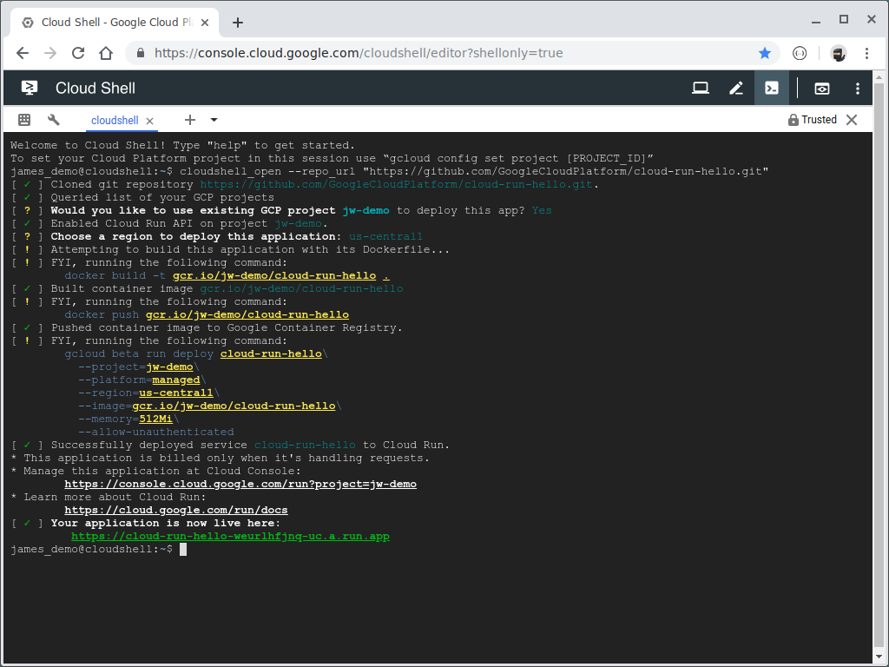

# Cloud Run Button

If you have a public repository, you can add this button to your `README.md` and
let anyone deploy your application to [Google Cloud Run][run] with a single
click.

[run]: https://cloud.google.com/run

Try it out with a "hello, world" Go application ([source](https://github.com/GoogleCloudPlatform/cloud-run-hello)):

[](https://deploy.cloud.run/?git_repo=https://github.com/GoogleCloudPlatform/cloud-run-hello.git)

### Demo

[](https://storage.googleapis.com/cloudrun/cloud-run-button.gif)

### Add the Cloud Run Button to Your Repo's README

1. Copy & paste this markdown:

    ```text
    [](https://deploy.cloud.run)
    ```

1. If the repo contains a `Dockerfile`, it will be built using the `docker build` command.  If the repo uses Maven for
   the build and it contains the [Jib plugin](https://github.com/GoogleContainerTools/jib/tree/master/jib-maven-plugin),
   then the container image will be built with Jib
   ([Jib Spring Boot Sample](https://github.com/GoogleContainerTools/jib/tree/master/examples/spring-boot)).  Otherwise,
   [CNCF Buildpacks](https://buildpacks.io/) (i.e. the `pack build` command) will attempt to build the repo
   ([buildpack samples][buildpack-samples]).  Alternatively, you can skip these built-in build methods using the
   `build.skip` field (see below) and use a `prebuild` or `postbuild` hook to build the container image yourself.

[buildpack-samples]: https://github.com/GoogleCloudPlatform/buildpack-samples

### Customizing source repository parameters

- When no parameters are passed, the referer is used to detect the git repo and branch
- To specify a git repo, add a `git_repo=URL` query parameter
- To specify a git branch, add a `revision=BRANCH_NAME` query parameter.
- To run the build in a subdirectory of the repo, add a `dir=SUBDIR` query parameter.


### Customizing deployment parameters

If you include an `app.json` at the root of your repository, it allows you
customize the experience such as defining an alternative service name, or
prompting for additional environment variables.

For example, a fully populated `app.json` file looks like this:

```json
{
    "name": "foo-app",
    "env": {
        "BACKGROUND_COLOR": {
            "description": "specify a css color",
            "value": "#fefefe",
            "required": false
        },
        "TITLE": {
            "description": "title for your site"
        },
        "APP_SECRET": {
            "generator": "secret"
        },
        "ORDERED_ENV": {
            "description": "control the order env variables are prompted",
            "order": 100
        }
    },
    "options": {
        "allow-unauthenticated": false,
        "memory": "512Mi",
        "cpu": "1",
        "port": 80,
        "http2": false
    },
    "build": {
        "skip": false,
        "buildpacks": {
            "builder": "some/builderimage"
        }
    },
    "hooks": {
        "prebuild": {
            "commands": [
                "./my-custom-prebuild"
            ]
        },
        "postbuild": {
            "commands": [
                "./my-custom-postbuild"
            ]
        },
        "precreate": {
            "commands": [
                "echo 'test'"
            ]
        },
        "postcreate": {
            "commands": [
                "./setup.sh"
            ]
        }
    }
}
```

Reference:

- `name`: _(optional, default: repo name, or sub-directory name if specified)_
  Name of the Cloud Run service and the built container image. Not validated for
  naming restrictions.
- `env`: _(optional)_ Prompt user for environment variables.
  - `description`:  _(optional)_ short explanation of what the environment
    variable does, keep this short to make sure it fits into a line.
  - `value`: _(optional)_ default value for the variable, should be a string.
  - `required`, _(optional, default: `true`)_ indicates if they user must provide
    a value for this variable.
  - `generator`, _(optional)_ use a generator for the value, currently only support `secret`
  - `order`, _(optional)_ if specified, used to indicate the order in which the
    variable is prompted to the user. If some variables specify this and some
    don't, then the unspecified ones are prompted last.
- `options`: _(optional)_ Options when deploying the service
  - `allow-unauthenticated`: _(optional, default: `true`)_ allow unauthenticated requests
  - `memory`: _(optional)_ memory for each instance
  - `cpu`: _(optional)_ cpu for each instance
  - `port`: _(optional)_ if your application doesn't respect the PORT environment
    variable provided by Cloud Run, specify the port number it listens on
  - `http2`: _(optional)_ use http2 for the connection
- `build`: _(optional)_ Build configuration
  - `skip`: _(optional, default: `false`)_ skips the built-in build methods (`docker build`, `Maven Jib`, and
 `buildpacks`), but still allows for `prebuild` and `postbuild` hooks to be run in order to build the container image
 manually
  - `buildpacks`: _(optional)_ buildpacks config (Note: Additional Buildpack config can be specified using a `project.toml` file. [See the spec for details](https://buildpacks.io/docs/reference/config/project-descriptor/).)
    - `builder`: _(optional, default: `gcr.io/buildpacks/builder:v1`)_ overrides the buildpack builder image
- `hooks`: _(optional)_ Run commands in separate bash shells with the environment variables configured for the
  application and environment variables `GOOGLE_CLOUD_PROJECT` (Google Cloud project), `GOOGLE_CLOUD_REGION`
  (selected Google Cloud Region), `K_SERVICE` (Cloud Run service name), `IMAGE_URL` (container image URL), `APP_DIR`
  (application directory). Command outputs are shown as they are executed.
  - `prebuild`: _(optional)_ Runs the specified commands before running the built-in build methods. Use the `IMAGE_URL`
    environment variable to determine the container image name you need to build.
    - `commands`: _(array of strings)_ The list of commands to run
  - `postbuild`: _(optional)_ Runs the specified commands after running the built-in build methods. Use the `IMAGE_URL`
    environment variable to determine the container image name you need to build.
    - `commands`: _(array of strings)_ The list of commands to run
  - `precreate`: _(optional)_ Runs the specified commands before the service has been created
    - `commands`: _(array of strings)_ The list of commands to run
  - `postcreate`: _(optional)_ Runs the specified commands after the service has been created; the `SERVICE_URL` environment variable provides the URL of the deployed Cloud Run service
    - `commands`: _(array of strings)_ The list of commands to run

### Notes

- Disclaimer: This is not an officially supported Google product.
- See [LICENSE](./LICENSE) for the licensing information.
- See [Contribution Guidelines](./CONTRIBUTING.md) on how to contribute.
